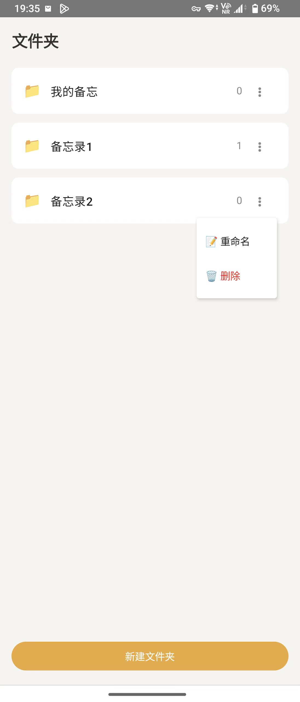

## 软件功能

没搞什么花哨的功能，风格类似iphone的,简单明了，主打一个省心：

- **分类管理**：文件夹可以随时新建、重命名、删除，分类逻辑很直接。
- **本地存储**：数据全存在手机本地，没有任何联网权限，不用担心隐私上传到服务器。
- **增删改查**：笔记的写、改、删逻辑都做好了，满足日常随手记的需求。
- **交互简洁**：界面就是简单的 Mac 风格，没乱七八糟的干扰。

## 预览

|  |  |  |
|----------|----------|----------|
|  |  |  |

## 技术栈

- 使用Android Studio 开发
  

 ## 关于

- 1.作者:希米
- 2.原文：https://www.ximi.me/post-6041.html
- 3.最后更新:2026-06-10

